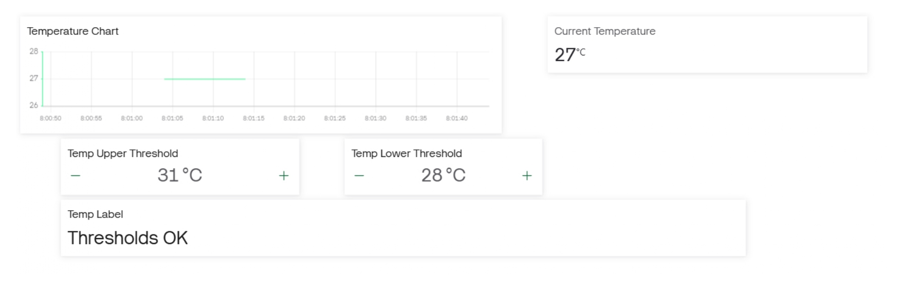
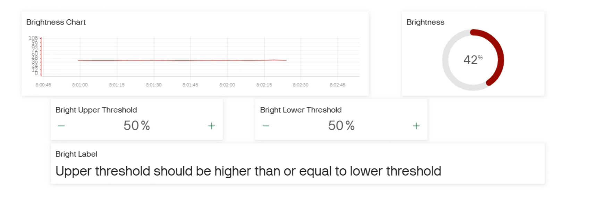
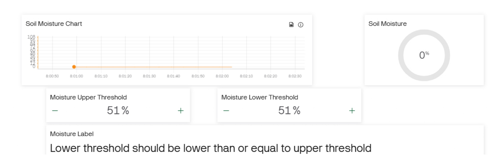
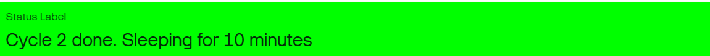
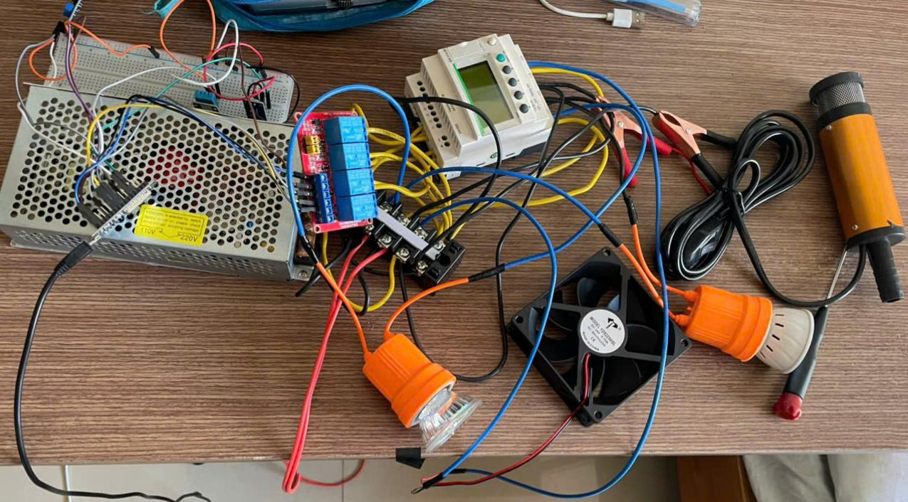

Project Overview: Describe the physical layout diagram of the cabinet, as well as showing where the ESP32, PLC, relays, and water pump are positioned to connect to the input and output devices efficiently

Build Progress: 

*The temperature, soil moisture, and lighting data that is sent from ESP32 to Arduino, a software that is designed to read inputs and turn them to outputs*

https://youtu.be/XqmHnOMMV8o

*A video showing the data that is read from the sensors being uploaded and updated on the Blynk app, which will inform the user about the conditions inside of the cabinet*

*A diagram showing the wiring to the PLC, with the assumption of inputs as switches, since they both produce HIGH and LOW signals*

*The overall wiring diagram, which shows the connections between the ESP32, relay, and PLC Schneider SR2*

*A circuit that is built on a breadboard with sensors to collect data from the surrounding, which will be repositioned inside of the cabinet later on*

*The charts plot live data over time to identify fluctuations, while the real-time gauges and value display show the exact readout from the connected sensors at the current moment. Moreover, the thresholds adjusters allow users to modify the trigger setpoints and actively control the growing conditions of any plants. The lower threshold is the minimum level to trigger an action (turning on the light or water pump), while the upper threshold is the maximum level to turn off those equipments. Finally, the labels are used to announce the validation of the limits. If the upper threshold is lower than the lower threshold or the lower threshold is higher than the upper threshold, they will be set to an equal value while reminding the user through the labels*

*A new status label has been added to announce the status of the ESP32. This is mainly because a deep sleep cycle has been enabled for it, which shuts down the CPU, Wifi, and Bluethooth. It is advantageous since it can reduce power consumption, sensors degradation, and data redundancy (temperature, moisture, and brightness may change insignificantly in a short time period). Now, the ESP can sleep for roughly 15 minutes, stay awake for a minute for the sensors to observe the conditions and send data to the cloud server once every 10 seconds. If one condition is lower than the lower threshold, the corresponding output is turned on in that 10 seconds to change it before being checked again. During this process, the label will announce the user that "Cycle # active", and after completing that cycle, it will announce "Cycle # done", and the ESP32 changes to its sleep mode. Ideally, the cycle number increases over time if the whole system is powered 24/24, so if it stays at the same number for too long, there is something wrong with the ESP32. Another way to detect a problem is by looking at the cloud server. It has been changed so that the time it takes to change from "Online" to "Offline" is always longer than the cycle time. For example, if the ESP wakes up once in every 10 minutes, the time it takes  for the Blynk server to turns from "Online" to "Offline" is about 20 minutes. Consequently, it will always show "Online" regarding the condition of the ESP (awake or sleep). If it suddenly turns to "Offline", which means the ESP has not responded for a long time, there might be some troubles*

*This is the completed circuit, with the 24V power source for the ventilation fan and water pump, relay, ESP32, PLC Schneider, sensors, and two light bulbs that use 220VDC"

## Final Product
.jpg)
.jpg)
The overall look of the smart plant cabinet. A water box, which contains the water pump to transfer water through a pipe into the cabinet to water the plants, and an electrical box, where the PLC, ESP32, relays, and terminal blocks are located, are screwed from opposite sides, while the lamps are on the lid. The ventilation fan is screwed to the other side of the cabinet

.jpg)
.jpg)
The water box has two openings. The first one is to leave a gap to connect the pump with the irrigation pipe, and the second one is used to fill water manually after some time for the pump to operate. The pipe is led to the inside of the cabinet, where it is connected to multiple dripper heads to water multiple spots inside. These dripper heads can be modified to increase or decrease the water flow rate, which affects the soil moisture a lot

.jpg)
.jpg)
There is a circuit breaker, which stops the electricity flow when the current reaches an unsafe level, and a 24V power source for the fan and pump next to the electrical box. The interior of the box can be seen, too

.jpg)
This is the final setup of the cabinet to grow plants. Mustard green seeds are chosen, so they have been buried to germinate and be grown automatically. The conditions to switch on/off can be changed through the cloud server of the Blynk app, and the data received from the sensors can be seen by the user from the desktop/mobile version, so there is no need for human interactions (except from filling up water for the water pump)
